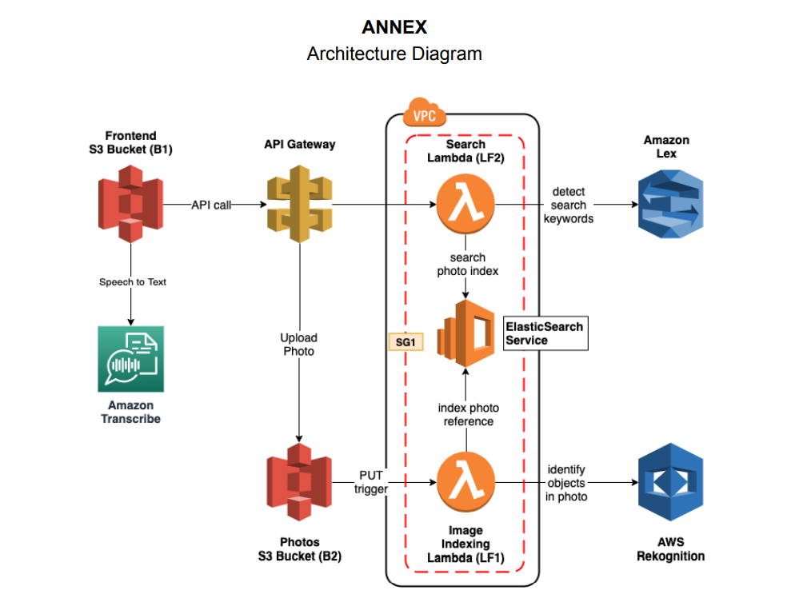

# Smart Photo Album

In this project, I implemented a photo album web application that can be searched using natural language through both text and voice.

### Description
The photo album is a scalable web application designed and deployed using AWS services including Cloud Formation, CodePipeline, S3, Amazon Lex, OpenSearch Service, API gateway. CI/CD DevOps pipeline is used to automate the build, test and deploy phases. The application allows users to make search requests, display the search results resulting from the query as well as upload new photos. The user is also given a choice to use either voice or text to perform the search queries.

### Working Principle

* Designing the Architecture and use AWS Cloud Formation to develop each service.
* Established AWS CodePipeline to connect github and AWS for synchronizing code between GitHub and AWS, ensuring that changes made to githunb are reflected in AWS.
* The frontend for the application is hosted in an S3 bucket as a static website.
* Using the AWS OpenSearch service a domain is set up so that when a photo gets uploaded to the bucket, lambda funciton is triggered to index it.
* Labels are detected in the image using Rekognition. A JSON object with a reference to each object in the S3 is stored in an OpenSearch index, for every label detected by the Rekognition service.
* A lambda function called 'search-photos' is used as a code hook for the Lex service in order to detect the search keywords.
* Amazon Lex bot is created to handle search queries for which an intent called 'SearchIntent' is created and training utterances are added to the intent.

### Architecture
### 
